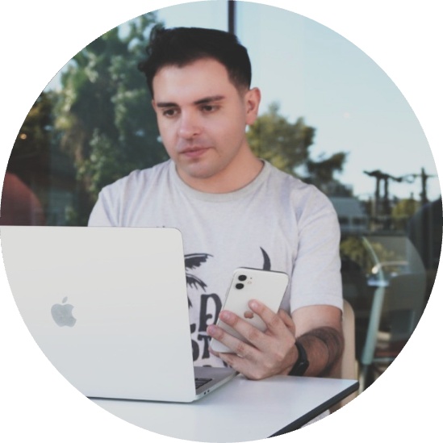

# 👥 Perfiles Profesores

  

    
    <h3>Sebastián Azócar</h3>
    <em>Data Scientist and Teacher</em>  
    👨‍🎓 Mathematical Engineer & Master in Data Science 
    🏡 Lives in Santiago, Chile 
    🌍 Loves traveling and learning 
    📊 Passionate about data analysis 
    🔗 <a href="https://www.linkedin.com/in/sebasti%C3%A1n-az%C3%B3car/">LinkedIn</a>
  

  

    
    <h3>Fernando Díaz H., PhD</h3>
    <em>Professor & MBA Program Director</em>  
    🎓 Ph.D. in Finance (Purdue), MSc. in Finance and Economics (LSE), MA in Economics (PUC) 
    👨‍🏫 Professor at UTFSM 
    📈 Focus on Finance, Econometrics, ML 
    🔗 <a href="https://www.linkedin.com/in/frdiazh/">LinkedIn</a>
  

---

> 👆 Ambos profesionales colaboran en el curso de Ciencia de Datos aplicado a la gestión y negocios en la Universidad Técnica Federico Santa María.
